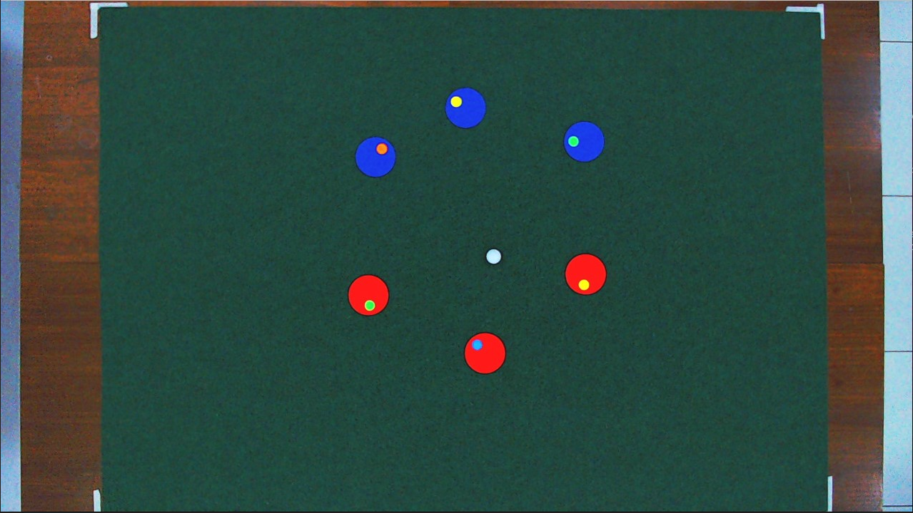

# RoboSoccer LabSens-PUCV


## Propósito del algoritmo
El algoritmo tiene como propósito ser la visión artificial de una cámara ubicada en altura, la cual debe ser capaz de detectar a los diferentes robots dentro del campo de juego. Estos robots poseen dos círculos en su cabecera, uno grande el cual sirve para diferenciar a los equipos, y uno pequeño, el cual sirve para diferenciar a los jugadores. Adicionalmente también debe ser capaz de detectar una pelota en el campo de juego.



## Librerías utilizadas
Se utilizaron un par de librerías, las cuales son la base del proyecto actual, las cuales son las siguientes:
- OpenCV
- Chrono
- YAML
- BOOST
- Iostream
- Fstream

## Funcionamiento del algoritmo
Existen dos algoritmos desarrollados en C++ los cuales son similares, pero poseen diferentes funcionalidades.
- calibration.cpp
    - Este algoritmo permite al usuario visualizar mediante una interfaz en Ubuntu lo que está observando la cámara en tiempo real, con el motivo de realizar una calibración de los colores, verificar los parámetros de Hough o lo que estime conveniente, ya que podrá ver la detección en tiempo real.
- roso.cpp
    - Este algoritmo permite al usuario enviar datos a una dirección IP y puerto establecidos en el archivo de configuración, en donde se hace un envío de las posiciones en el campo de juego de todos los robots en adición con sus ángulos respectivos y las coordenadas de la pelota. 

> [!IMPORTANT]
> El archivo de configuración para ambos códigos es el de parameters.yaml. Para el algoritmo del servidor se utiliza config.json.

> [!WARNING]
> El algoritmo calibration.cpp posee un problema cuando un robot sale o entra al ROI, deteniendo el código. Como recomendación no se deben salir de la cancha, y si se quiere ingresar, que sea con la mano encima.

## Cámara
Este algoritmo está desarrollado con la cámara C922 PRO de Logitech, la cual entrega una resolución máxima de 1920x1080 a 30 FPS en el entorno de Ubuntu. Adicionalmente, esta cámara no es configurable en ese entorno (brillo, saturación, etc.) por lo que se opta a utilizar el software Logitech G HUB y configurar la cámara con estos parámetros:


> [!NOTE]
> Al ejecutar el algoritmo muchas veces, la cámara tiende a colocarse más oscura, por lo que es necesario desconectarla y volverla a conectar al entorno de Ubuntu.

## Paginas utilizadas para realizar la calibración de colores
Para realizar la calibración, el procedimiento consiste en capturar diferentes fotogramas en tiempo real de la cámara y almacenarlos. Luego mediante el [Selector de color en imagen](https://imagecolorpicker.com/es) se carga la imagen y se toma el valor en HEX de los diferentes pixeles para cada color a calibrar. Posteriormente se utiliza un [Convertidor de color (HEX a HSV)](https://www.peko-step.com/es/tool/hsvrgb.html) en donde se transforma de HEX a HSV, el cual utiliza el algoritmo en cuestión.

> [!NOTE]
> En la página los valores en HSV deben estar de H: 0-360, S: 0-255, V: 0-255 ya que así es más fácil trabajarlos. Adicionalmente la escala que usa OpenCV para los valores de HSV es distinta, donde recomiendo revisar el siguiente enlace [OpenCV: Changing Colorspaces](https://docs.opencv.org/3.4/df/d9d/tutorial_py_colorspaces.html).

## Compilación del algoritmo utilizando g++
Para el archivo roso.cpp
```
g++ -std=c++11 -o roso roso.cpp `pkg-config --cflags --libs opencv4` -lboost_system -lboost_thread -pthread -lyaml-cpp -fopenmp
```
Para el archivo calibration.cpp
```
g++ -o calibration calibration.cpp `pkg-config --cflags --libs opencv4` -lyaml-cpp -fopenmp
```

## Procedimiento para que el algoritmo funcione correctamente
1. Conectar la cámara web al computador a utilizar.
2. Iniciar el programa Logitech G HUB con los parámetros configurados.
3. Iniciar la máquina virtual con el entorno Ubuntu.
4. Verificar que todas las librerías se encuentren instaladas.
5. Habilitar la cámara web en el entorno Ubuntu.
6. Compilar el algoritmo.
7. Si se ejecuta roso, iniciar el algoritmo de server.py primero. Si se ejecuta calibration, continuar al siguiente paso.
8. Seleccionar el ROI (Región de interés) y presionar Enter.
9. Verificar si la detección o envío de datos es el correcto.

## Posibles mejoras del algoritmo actual
1. Adquirir una cámara dedicada con alta tasa de fotogramas y compatible con Ubuntu.
2. Separar el cálculo interno de la función HoughCircles para la detección de círculos pequeños.
3. Mejorar el código de calibración para que evite que se cierre al momento de que un círculo salga del ROI.
4. Para los robots, se recomienda el uso de RF en vez de BT debido a que no puede fijarse en canales de frecuencia. Para más información revisar el siguiente [enlace](https://robocup-ssl.github.io/ssl-rules/sslrules.html#_vision).
5. Buscar una forma de que se calculen ROIs para cada robot en base a su coordenada anterior para ahorrar memoria.
6. Implementar YOLO o IA para mejorar detección.
7. Modularizar el código.
8. Tratar de cambiar el formato de los círculos en base a los colores de la RoboCup SSL.
